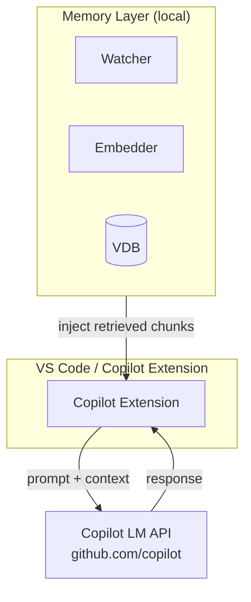
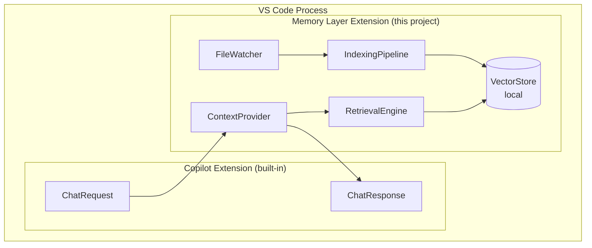
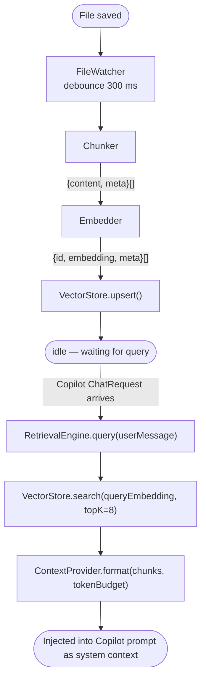

# Codebase Memory Layer — Technical Design

A locally-running memory layer that gives GitHub Copilot (via its SDK) persistent, semantic awareness of your codebase across sessions.

---

## Table of Contents

1. [Overview](#overview)
2. [Goals](#goals)
3. [Architecture](#architecture)
4. [Core Components](#core-components)
5. [Data Flow](#data-flow)
6. [Embedding & Indexing Strategy](#embedding--indexing-strategy)
7. [GitHub Copilot SDK Integration](#github-copilot-sdk-integration)
8. [Local Storage Layer](#local-storage-layer)
9. [Retrieval & Context Injection](#retrieval--context-injection)
10. [API Surface](#api-surface)
11. [Tech Stack](#tech-stack)
12. [Directory Structure](#directory-structure)
13. [Security & Privacy](#security--privacy)
14. [Future Work](#future-work)

---

## Overview

The **Codebase Memory Layer** is a local service that continuously indexes your repository, stores vector embeddings of code chunks, and injects semantically relevant context into every GitHub Copilot request — without sending raw source code to a remote server.

It sits between your editor (VS Code) and the GitHub Copilot Language Model API as a **context enrichment middleware**.



---

## Goals

| Goal | Description |
|------|-------------|
| **Local-first** | All indexing, storage, and retrieval happen on-device. No source code leaves the machine. |
| **Persistent memory** | Relevant code context survives across Copilot sessions and workspace restarts. |
| **Semantic search** | Retrieve by meaning, not just keyword/file path. |
| **Copilot SDK native** | Plug directly into the `@github/copilot-language-model` SDK extension API. |
| **Incremental updates** | Only re-index files that changed (watch-based). |
| **Low latency** | Retrieval must complete in < 100 ms to avoid prompt latency regressions. |

---

## Architecture



---

## Core Components

### 1. FileWatcher
- Uses `vscode.workspace.createFileSystemWatcher` to detect create / change / delete events.
- Debounces rapid saves (300 ms window) before triggering re-indexing.
- Respects `.gitignore` and a user-configurable `memory.exclude` glob list.

### 2. Chunker
- Splits source files into **semantically meaningful chunks** rather than fixed-size windows.
- Strategy per language:
  - **TypeScript / JavaScript** — tree-sitter AST → function / class / top-level statement boundaries.
  - **Python** — `ast` module → function / class / module docstring boundaries.
  - **Markdown / plaintext** — paragraph boundaries (double newline).
  - **Fallback** — 200-token sliding window with 40-token overlap.
- Each chunk carries metadata: `{ filePath, startLine, endLine, language, symbols[] }`.

### 3. Embedder
- Runs a local embedding model via **ONNX Runtime** (no GPU required).
- Default model: `nomic-embed-code` (768-dim, Apache-2 licence) — swappable via config.
- Batches chunks (up to 32 at a time) for throughput.
- Caches embeddings by `(filePath, contentHash)` to skip unchanged chunks on re-index.

### 4. VectorStore
- Persists embeddings in a local **SQLite** database using the `sqlite-vec` extension.
- Schema:

```sql
CREATE TABLE chunks (
  id          TEXT PRIMARY KEY,   -- sha256(filePath + startLine)
  file_path   TEXT NOT NULL,
  start_line  INTEGER,
  end_line    INTEGER,
  language    TEXT,
  content     TEXT,
  symbols     TEXT,               -- JSON array
  updated_at  INTEGER
);

CREATE VIRTUAL TABLE chunk_vss USING vec0(
  embedding FLOAT[768]
);
```

- Approximate nearest-neighbour search via `sqlite-vec`'s HNSW index (< 5 ms for 100k chunks).

### 5. RetrievalEngine
- Accepts a natural-language or code query string.
- Embeds the query with the same model used during indexing.
- Performs ANN search → returns top-K chunks (default K = 8).
- Post-filters by:
  - Active file's language (boosts same-language results).
  - Recency weight (`updated_at` within last 7 days gets +0.05 score boost).
  - Deduplication (removes chunks from the same function if already included).

### 6. ContextProvider
- Implements the `vscode.lm.registerTool` / chat participant `context` API.
- Formats retrieved chunks into a fenced code block with file path and line range header.
- Enforces a **token budget** (default 4 096 tokens) so injected context never exceeds the model's context window.
- Truncates lowest-scoring chunks first when over budget.

---

## Data Flow



---

## Embedding & Indexing Strategy

### Initial Full Index
On first activation (or after a clean-slate reset), the pipeline:
1. Enumerates all workspace files matching `memory.include` globs (default: `**/*.{ts,js,py,go,java,md}`).
2. Processes files in priority order: open editors → recently git-modified → rest.
3. Runs in a background `setTimeout`/`setImmediate` loop to avoid blocking the UI thread.
4. Reports progress via `vscode.window.withProgress`.

### Incremental Updates
- Only the changed file is re-chunked on save.
- Stale chunk rows (same `file_path`, old `updated_at`) are deleted after new chunks are inserted.
- File deletes trigger a `DELETE FROM chunks WHERE file_path = ?`.

### Content-Hash Deduplication
Each chunk stores `sha256(content)`. If the hash matches the stored value, the embedding step is skipped — only metadata is refreshed.

---

## GitHub Copilot SDK Integration

The extension uses the **VS Code Language Model API** (`vscode.lm`) introduced in VS Code 1.90.

### Registration

```typescript
// extension.ts
import * as vscode from 'vscode';
import { RetrievalEngine } from './retrieval';

export function activate(context: vscode.ExtensionContext) {
  const engine = new RetrievalEngine(context.globalStorageUri);

  // Register as a chat context provider tool
  const tool = vscode.lm.registerTool('codebase-memory', {
    description: 'Retrieves semantically relevant code snippets from the local codebase index.',
    inputSchema: {
      type: 'object',
      properties: {
        query: { type: 'string', description: 'Natural language or code query.' }
      },
      required: ['query']
    },
    async invoke(input: { query: string }, _token: vscode.CancellationToken) {
      const chunks = await engine.retrieve(input.query);
      return new vscode.lm.ToolResult([
        new vscode.lm.TextPart(formatChunks(chunks))
      ]);
    }
  });

  context.subscriptions.push(tool);
}
```

### Automatic Context Injection via Chat Participant

```typescript
const participant = vscode.chat.createChatParticipant('memory.assistant', async (req, ctx, stream, token) => {
  // 1. Retrieve relevant chunks for the user's message
  const chunks = await engine.retrieve(req.prompt);
  const contextBlock = formatChunks(chunks);

  // 2. Build messages array — prepend retrieved context as system message
  const messages = [
    vscode.LanguageModelChatMessage.User(
      `[Codebase Context]\n${contextBlock}\n\n[User Request]\n${req.prompt}`
    )
  ];

  // 3. Forward to Copilot model
  const model = req.model;  // model selected by user in chat UI
  const response = await model.sendRequest(messages, {}, token);

  for await (const part of response.text) {
    stream.markdown(part);
  }
});
```

### Tool Auto-Invocation (Copilot Agentic Mode)

When GitHub Copilot operates in **agent mode**, it can auto-invoke `codebase-memory` as a tool whenever it judges that codebase context would help. No manual wiring is required beyond the `registerTool` call above.

---

## Local Storage Layer

| Data | Location | Format |
|------|----------|--------|
| Vector DB | `~/.vscode/globalStorage/<ext-id>/memory.db` | SQLite + sqlite-vec |
| Embedding cache | same DB, `embedding_cache` table | BLOB (float32 array) |
| Config / state | `context.globalState` (VS Code built-in) | JSON |
| Logs | VS Code Output Channel `"Codebase Memory"` | Plain text |

The database is a single portable file — easy to backup, wipe, or migrate.

---

## Retrieval & Context Injection

### Query Construction
The retrieval query is built from multiple signals:

```
query = activeEditorSelection        (highest weight)
      + currentFileSymbolsInView     (medium weight)
      + last 3 user chat turns       (low weight)
```

These are concatenated (with section headers) before embedding, so the vector captures multi-signal intent.

### Token Budget Enforcement

```
available_tokens = model_context_window
                 - system_prompt_tokens
                 - conversation_history_tokens
                 - response_reserve (1024)
                 ─────────────────────────────
                 = budget for injected context
```

Chunks are added highest-score-first until the budget is exhausted.

---

## API Surface

Internal TypeScript interfaces consumed by sub-components:

```typescript
interface Chunk {
  id: string;
  filePath: string;
  startLine: number;
  endLine: number;
  language: string;
  content: string;
  symbols: string[];
  updatedAt: number;
}

interface RetrievalResult {
  chunk: Chunk;
  score: number;      // cosine similarity [0, 1]
}

interface MemoryLayerConfig {
  include: string[];          // glob patterns to index
  exclude: string[];          // glob patterns to skip
  embeddingModel: string;     // model file path or registry key
  topK: number;               // chunks to retrieve per query
  tokenBudget: number;        // max tokens for injected context
  chunkOverlapTokens: number; // overlap for fallback chunker
}
```

---

## Tech Stack

| Layer | Technology | Rationale |
|-------|-----------|-----------|
| Extension host | **TypeScript + VS Code Extension API** | Native Copilot SDK access |
| Chunking (TS/JS) | **tree-sitter** (WASM build) | Accurate AST boundaries, runs in-process |
| Chunking (Python) | **python-ast** via child process | Reuses Python's built-in parser |
| Embedding model | **ONNX Runtime Web** + `nomic-embed-code` | Local, CPU-only, no Python dep |
| Vector store | **SQLite** + **sqlite-vec** extension | Single-file, zero server, fast ANN |
| File watching | `vscode.workspace.createFileSystemWatcher` | Native, low overhead |
| Testing | **Vitest** + VS Code Extension Test Runner | Fast unit + integration tests |

---

## Directory Structure

```
codebase-memory-layer/
├── src/
│   ├── extension.ts          # activate / deactivate entry point
│   ├── watcher.ts            # FileWatcher
│   ├── chunker/
│   │   ├── index.ts          # Chunker dispatcher
│   │   ├── treeSitter.ts     # TS/JS chunking via tree-sitter
│   │   ├── pythonAst.ts      # Python chunking
│   │   └── fallback.ts       # Sliding-window fallback
│   ├── embedder.ts           # ONNX embedding model wrapper
│   ├── vectorStore.ts        # SQLite + sqlite-vec wrapper
│   ├── retrieval.ts          # RetrievalEngine
│   ├── contextProvider.ts    # VS Code lm tool + chat participant
│   └── config.ts             # MemoryLayerConfig schema + defaults
├── models/
│   └── nomic-embed-code.onnx # Bundled local embedding model
├── test/
│   ├── chunker.test.ts
│   ├── embedder.test.ts
│   └── retrieval.test.ts
├── package.json
├── tsconfig.json
└── README.md
```

---

## Security & Privacy

- **No source code egress** — raw file content is never sent to any remote endpoint. Only the final assembled prompt (which may include retrieved snippets) travels to the Copilot API, identical to what Copilot already receives today.
- **Local model** — the ONNX embedding model runs fully in-process; no network calls.
- **Workspace isolation** — each VS Code workspace root gets its own index partition; no cross-workspace leakage.
- **Secret detection** — chunks containing patterns matching common secret formats (API keys, tokens) are flagged and excluded from context injection by default.
- **User opt-out** — individual files or directories can be excluded via `memory.exclude` in VS Code settings.

---

## Future Work

| Item | Notes |
|------|-------|
| Multi-repo / monorepo support | Partition index by workspace folder root |
| Symbol graph overlay | Layer a call-graph index on top of vector search for more precise retrieval |
| Fine-tuned retrieval model | Domain-specific embedding model trained on code retrieval tasks |
| Remote index sync | Optional encrypted sync of the index (not raw code) across machines |
| MCP server mode | Expose the retrieval engine as a [Model Context Protocol](https://modelcontextprotocol.io) server so any MCP-compatible client can consume it |
| Telemetry dashboard | VS Code WebView showing index stats, cache hit rate, retrieval latency |
